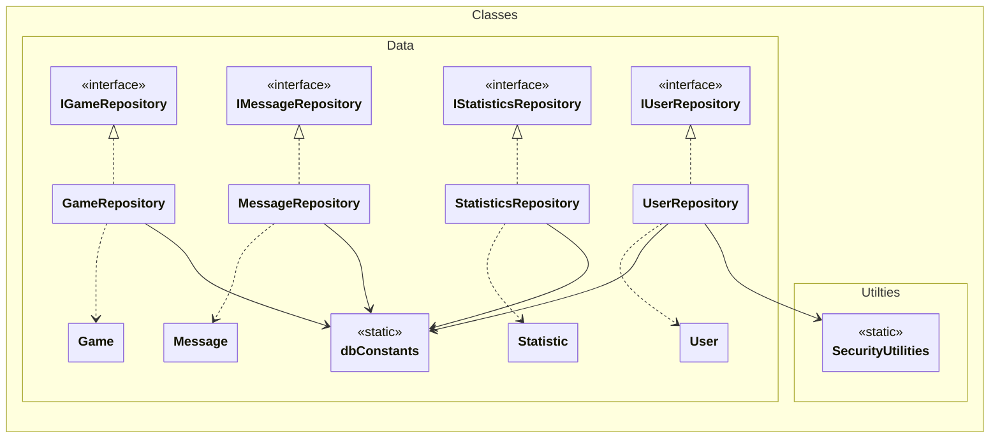

```mermaid
---
  config:
    class:
      hideEmptyMembersBox: true
---
classDiagram
direction LR

namespace Classes.Data {
  class dbConstants {
    <<static>>
  }
  class Game
  class GameRepository
  class IGameRepository {
    <<interface>>
  }
  class IMessageRepository {
    <<interface>>
  }
  class IStatisticsRepository {
    <<interface>>
  }
  class IUserRepository {
    <<interface>>
  }
  class Message
  class MessageRepository
  class Statistic
  class StatisticsRepository
  class User
  class UserRepository
}

namespace Classes.Utilties {
  class SecurityUtilities {
    <<static>>
  }
}

IGameRepository <|.. GameRepository
IMessageRepository <|.. MessageRepository
IStatisticsRepository <|.. StatisticsRepository
IUserRepository <|.. UserRepository

GameRepository ..> Game
MessageRepository ..> Message
StatisticsRepository ..> Statistic
UserRepository ..> User

GameRepository --> dbConstants
MessageRepository --> dbConstants
StatisticsRepository --> dbConstants
UserRepository --> dbConstants

UserRepository --> SecurityUtilities
```