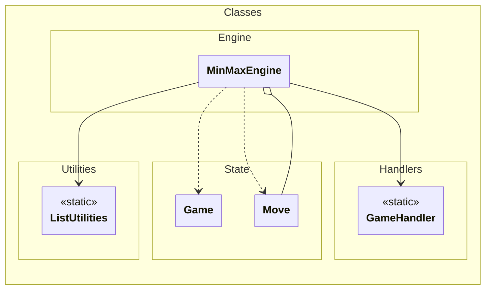

```mermaid
---
  config:
    class:
      hideEmptyMembersBox: true
---
classDiagram
direction LR

namespace Classes.Engine {
  class MinMaxEngine
}

namespace Classes.Utilities {
  class ListUtilities {
    <<static>>
  }
}

namespace Classes.State {
  class Game
  class Move
}

namespace Classes.Handlers {
  class GameHandler {
    <<static>>
  }
}

MinMaxEngine --> ListUtilities
MinMaxEngine ..> Game
MinMaxEngine ..> Move
MinMaxEngine o-- Move
MinMaxEngine --> GameHandler

```