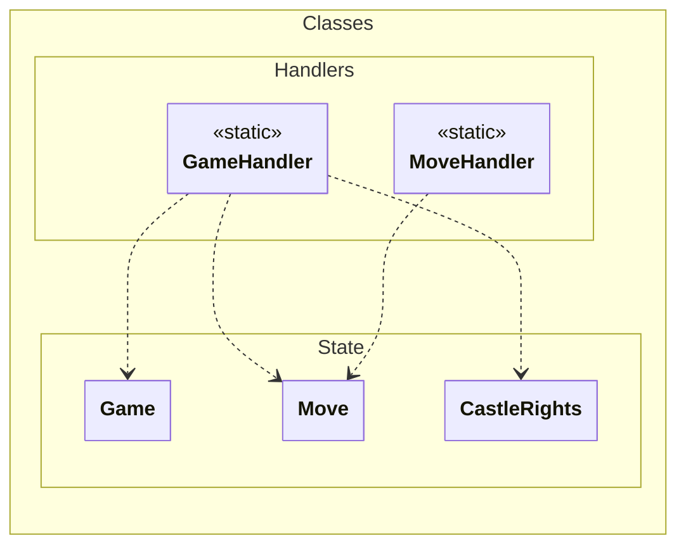

```mermaid
---
  config:
    class:
      hideEmptyMembersBox: true
---
classDiagram
direction LR

namespace Classes.Handlers {
  class GameHandler {
    <<static>>
  }
  class MoveHandler {
    <<static>>
  }
}

namespace Classes.State {
  class Game
  class Move
  class CastleRights
}

GameHandler ..> Game
GameHandler ..> Move
GameHandler ..> CastleRights
MoveHandler ..> Move

```