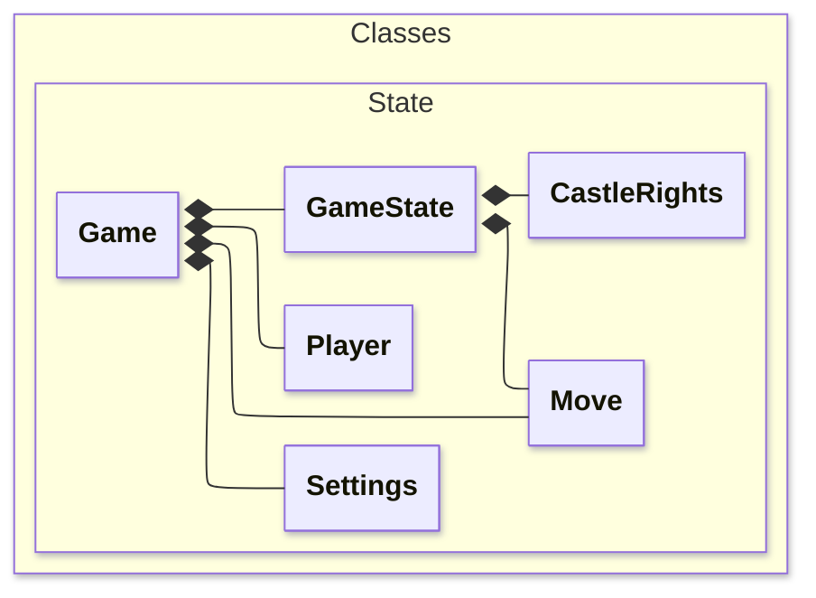

```mermaid
---
config:
  layout: elk
  theme: mc
  class:
    hideEmptyMembersBox: true
  look: neo
---
classDiagram
direction LR

namespace Classes.State {
  class CastleRights
  class Game
  class GameState
  class Move
  class Player
  class Settings
}

Game *-- GameState
Game *-- Move
Game *-- Player
Game *-- Settings

GameState *-- CastleRights
GameState *-- Move

```