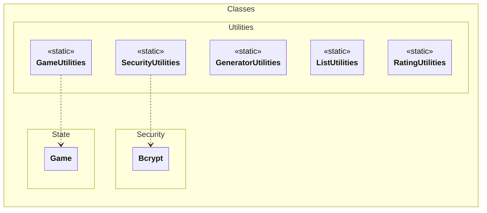

```mermaid
---
  config:
    class:
      hideEmptyMembersBox: true
---
classDiagram
direction LR

namespace Classes.Utilities {
  class GameUtilities {
    <<static>>
  }
  class GeneratorUtilities {
    <<static>>
  }
  class ListUtilities {
    <<static>>
  }
  class RatingUtilities {
    <<static>>
  }
  class SecurityUtilities {
    <<static>>
  }
}

namespace Classes.State {
  class Game
}

namespace Classes.Security {
  class Bcrypt
}

GameUtilities ..> Game
SecurityUtilities ..> Bcrypt
```