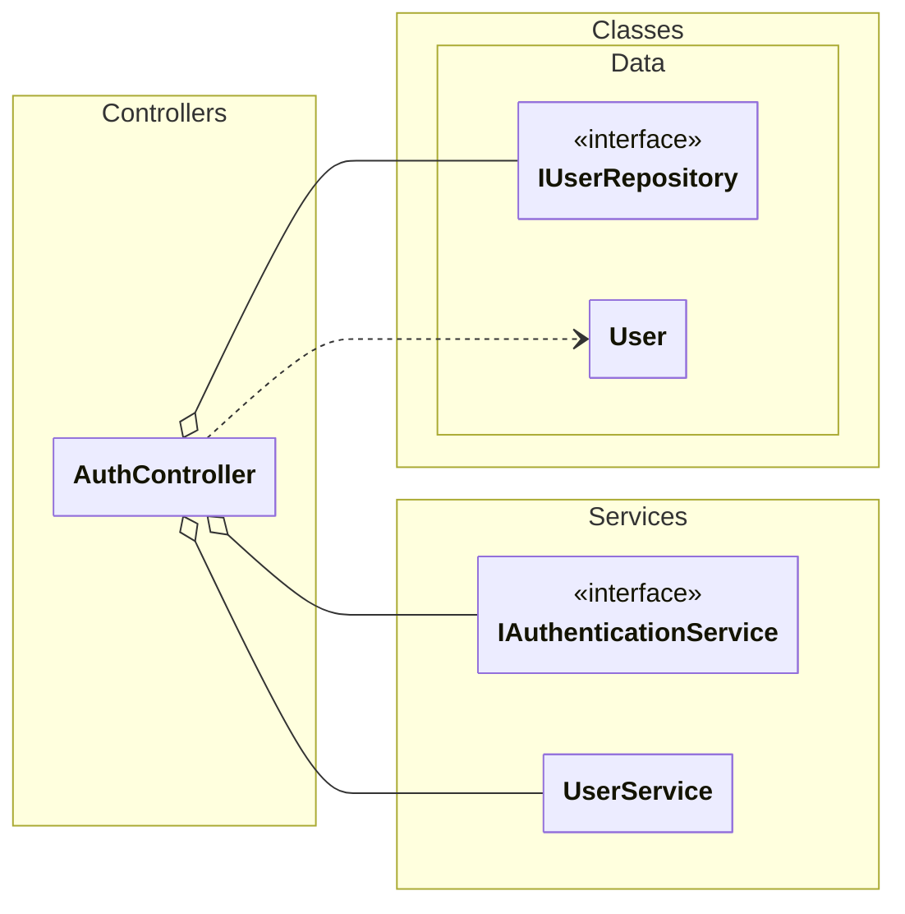

```mermaid
---
  config:
    class:
      hideEmptyMembersBox: true
---
classDiagram
direction LR

namespace Controllers {
  class AuthController
}

namespace Classes.Data {
  class IUserRepository {
    <<interface>>
  }
  class User
}

namespace Services {
  class IAuthenticationService {
    <<interface>>
  }
  class UserService
}

AuthController o-- IAuthenticationService
AuthController o-- UserService
AuthController o-- IUserRepository
AuthController ..> User
```