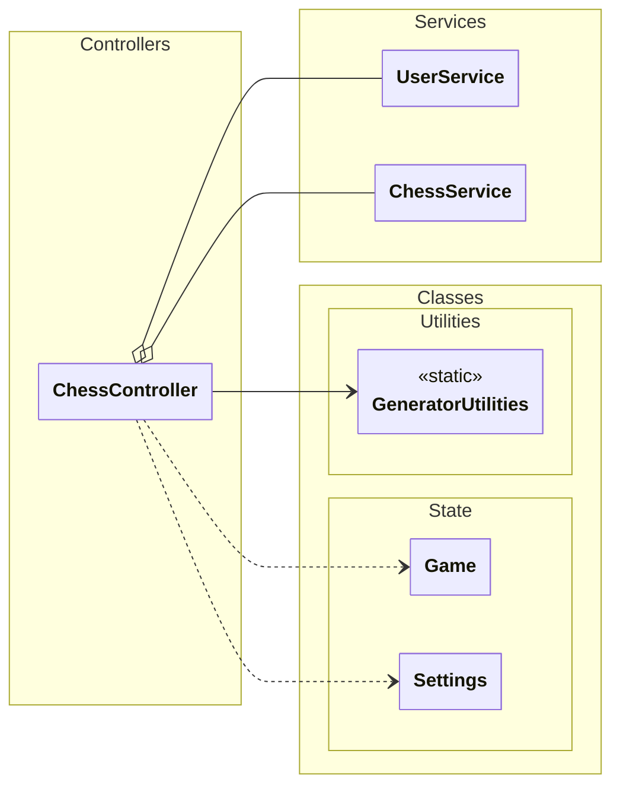

```mermaid
---
  config:
    class:
      hideEmptyMembersBox: true
---
classDiagram
direction LR

namespace Controllers {
  class ChessController
}

namespace Services {
  class UserService
  class ChessService
}

namespace Classes.Utilities {
  class GeneratorUtilities {
    <<static>>
  }
}

namespace Classes.State {
  class Game
  class Settings
}

ChessController o-- ChessService
ChessController o-- UserService
ChessController --> GeneratorUtilities
ChessController ..> Game
ChessController ..> Settings
```