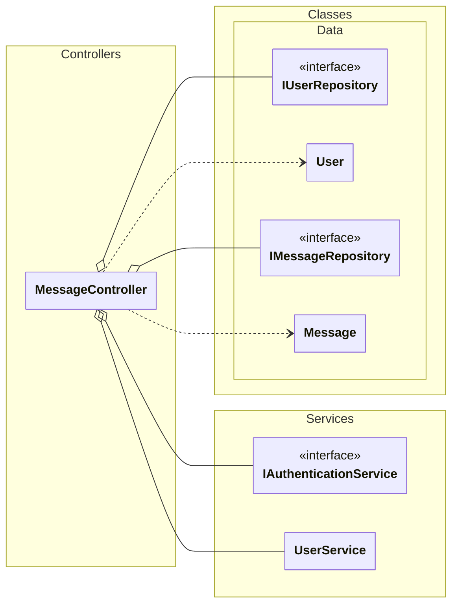

```mermaid
---
  config:
    class:
      hideEmptyMembersBox: true
---
classDiagram
direction LR

namespace Controllers {
  class MessageController
}

namespace Classes.Data {
  class IUserRepository {
    <<interface>>
  }
  class User
  class IMessageRepository {
    <<interface>>
  }
  class Message
}

namespace Services {
  class IAuthenticationService {
    <<interface>>
  }
  class UserService
}

MessageController o-- IAuthenticationService
MessageController o-- IUserRepository
MessageController o-- UserService
MessageController o-- IMessageRepository
MessageController ..> Message
MessageController ..> User
```