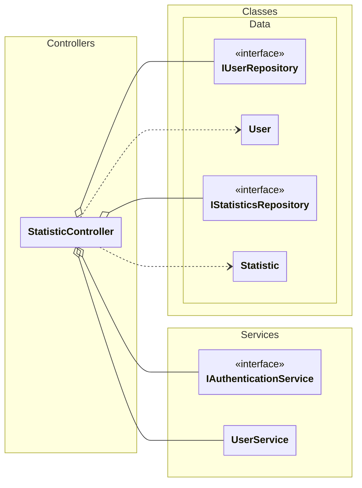

```mermaid
---
  config:
    class:
      hideEmptyMembersBox: true
---
classDiagram
direction LR

namespace Controllers {
  class StatisticController
}

namespace Classes.Data {
  class IUserRepository {
    <<interface>>
  }
  class User
  class IStatisticsRepository {
    <<interface>>
  }
  class Statistic
}

namespace Services {
  class IAuthenticationService {
    <<interface>>
  }
  class UserService
}

StatisticController o-- IStatisticsRepository
StatisticController o-- IUserRepository
StatisticController o-- UserService
StatisticController o-- IAuthenticationService
StatisticController ..> User
StatisticController ..> Statistic

```