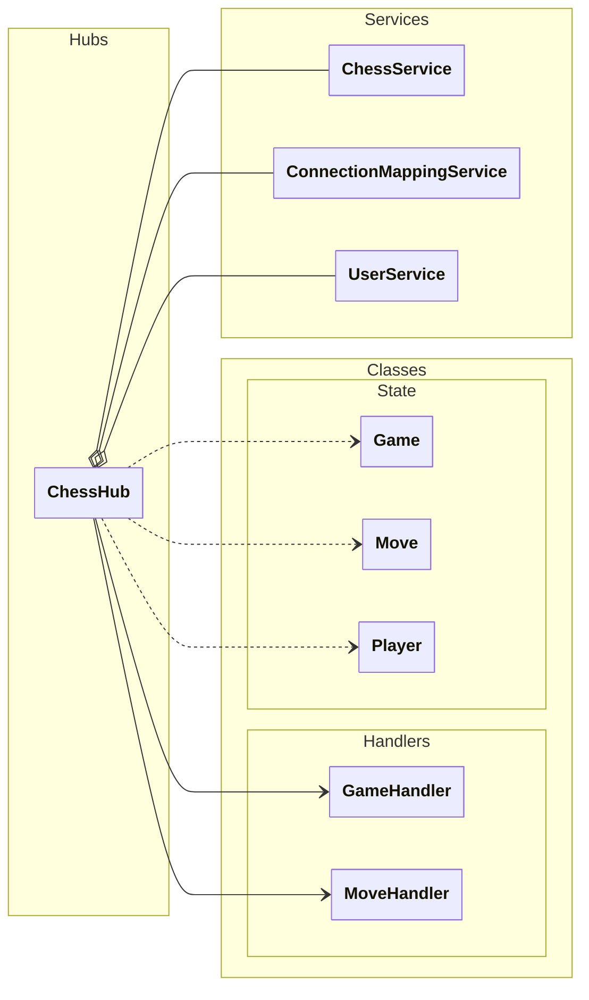

```mermaid
---
  config:
    class:
      hideEmptyMembersBox: true
---
classDiagram
direction LR

namespace Hubs {
  class ChessHub
}

namespace Services {
  class ChessService
  class ConnectionMappingService
  class UserService
}

namespace Classes.State {
  class Game
  class Move
  class Player
}

namespace Classes.Handlers {
  class GameHandler
  class MoveHandler
}

ChessHub o-- ChessService
ChessHub o-- ConnectionMappingService
ChessHub o-- UserService
ChessHub --> GameHandler
ChessHub --> MoveHandler
ChessHub ..> Game
ChessHub ..> Move
ChessHub ..> Player

```